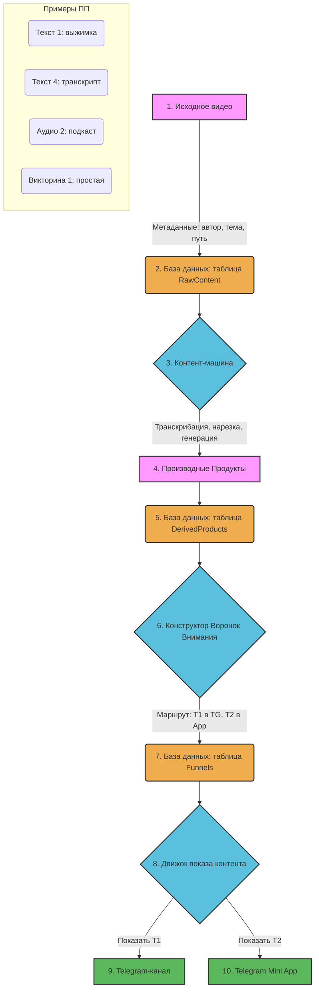

# Архитектура контентного пайплайна и воронок внимания

## 1. Ключевые термины

-   **Исходный Продукт:** Оригинальный контент (например, видео лекции). Обладает метаданными: `author`, `topic`, `source_path`, `permissions`.
-   **Производный Продукт (ПП):** Результат обработки Исходного Продукта. Это может быть текст, аудио, презентация, викторина и т.д. Каждый ПП имеет свой тип и уровень глубины.
-   **Классификация ПП:**
    -   `Т1`, `Т2`, `Т3`, `Т4`: Тексты разной степени детализации (от краткой выжимки до полной транскрибации).
    -   `А1`, `А2`, `А3`, `А4`: Аудио-версии разной длительности.
    -   `П1`, `П2`, `П3`, `П4`: Презентации разной насыщенности.
    -   `В1`, `В2`, `В3`, `В4`: Викторины разной сложности.
-   **Воронка Внимания:** Гибко настраиваемая последовательность показа Производных Продуктов пользователю. Определяет, *какой* ПП, *где* (в Telegram-канале, в Mini App, на платформе XL) и *когда* будет показан.

## 2. Процесс обработки и доставки контента

## 3. Архитектура базы данных

-   **`RawContent` (Исходные Продукты)**
    -   `id`: PK
    -   `author_id`: FK to Users
    -   `topic`: TEXT
    -   `source_path`: VARCHAR(255)
    -   `permissions`: JSONB

-   **`DerivedProducts` (Производные Продукты)**
    -   `id`: PK
    -   `raw_content_id`: FK to RawContent
    -   `type`: ENUM('text', 'audio', 'presentation', 'quiz')
    -   `level`: INT
    -   `content`: TEXT or JSONB
    -   `storage_path`: VARCHAR(255) (для файлов)

-   **`Funnels` (Воронки Внимания)**
    -   `id`: PK
    -   `name`: VARCHAR(255)

-   **`FunnelSteps` (Шаги Воронки)**
    -   `id`: PK
    -   `funnel_id`: FK to Funnels
    -   `step_number`: INT
    -   `derived_product_id`: FK to DerivedProducts
    -   `platform`: ENUM('telegram_channel', 'mini_app', 'xl_platform')
    -   `delay_hours`: INT (задержка в часах после предыдущего шага)

## 4. Инструмент для Контент-менеджера (Админ-панель)

Необходим внутренний интерфейс, который позволит:
1.  **Управлять Исходными Продуктами:** Загружать, редактировать метаданные.
2.  **Запускать "Контент-машину"**: Инициировать процесс генерации ПП.
3.  **Управлять Производными Продуктами:** Просматривать, редактировать и одобрять сгенерированный контент.
4.  **Конструировать Воронки Внимания:** Визуально (drag-and-drop) создавать последовательности из ПП, настраивать платформу и задержки для каждого шага.
5.  **Назначать Воронки:** Привязывать созданные воронки к сегментам пользователей или триггерам (например, "новая подписка").