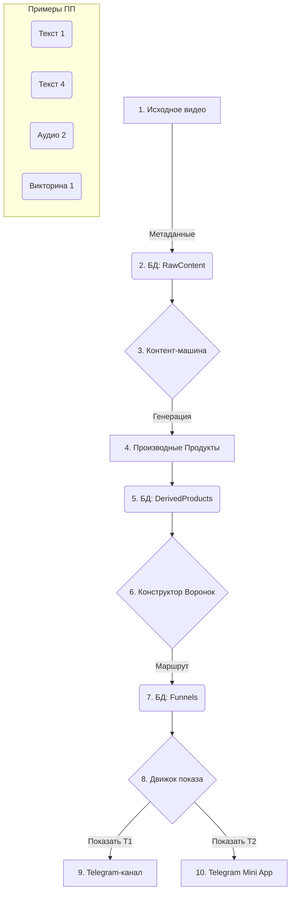

# Единая документация проекта "Контентная воронка" v2 (MVP+)

## 1. Философия и главные идеи

- **Итеративность:** Разработка короткими циклами «шаг → метрики → следующий шаг».
- **Фокус на MVP:** Минимальный жизнеспособный продукт для проверки гипотез.
- **Эксперт-центричность:** "Лица/звёзды" проекта (эксперты) — ключевая точка фокуса.
- **Экономика внимания:** Вознаграждение пользователей "звездами" за их вовлеченность.
- **Короткие смыслы:** Основа контента — микро-выжимки, карточки и цитаты.
- **Регулярность:** Создание ритма вовлечения через автоматизированные форматы (дайджесты).

## 2. Архитектура контентного пайплайна

### 2.1. Ключевые термины
-   **Исходный Продукт:** Оригинальный контент (видео, аудио лекция).
-   **Производный Продукт (ПП):** Результат обработки (текст, аудио-выжимка, викторина). Имеет тип и уровень глубины (например, `Т1` - краткий текст, `Т4` - полный транскрипт).
-   **Воронка Внимания:** Гибко настраиваемая последовательность показа ПП пользователю, определяющая *что, где и когда* показывать.

### 2.2. Процесс обработки и доставки контента

## 3. Архитектура системы (MVP+)

### 3.1. База данных
-   **`RawContent`:** Хранит метаданные исходных продуктов.
-   **`DerivedProducts`:** Хранит сгенерированные производные продукты.
-   **`Funnels` и `FunnelSteps`:** Описывают шаги и логику "Воронок Внимания".
-   **`Users`, `Gamification` и т.д.:** Стандартные таблицы для пользователей и геймификации.

### 3.2. Backend
-   **Монолит (MVP):** Node.js (NestJS) или Python (FastAPI).
-   **Модули:**
    -   **User Management:** Профили, аутентификация.
    -   **Content Pipeline:** Управление `RawContent` и `DerivedProducts`.
    -   **Funnel Engine:** Движок, отвечающий за прохождение пользователя по воронке.
    -   **Gamification:** Начисление "звезд".
    -   **Admin Panel:** Внутренний инструмент для контент-менеджеров.

### 3.3. Frontend (Telegram Mini App)
-   **Экраны MVP:** "Я-профиль", "Лента выжимок", "Галерея экспертов".
-   **Технологии:** React/Vue.js, TypeScript, Zustand/Redux, Tailwind CSS.

## 4. Инструмент для Контент-менеджера

Административная панель должна позволять:
1.  **Управлять контентом:** Загружать исходники, запускать их обработку, редактировать производные продукты.
2.  **Конструировать воронки:** Визуально (drag-and-drop) создавать последовательности из ПП, настраивать платформу (`telegram_channel`, `mini_app`) и задержки для каждого шага.
3.  **Назначать воронки:** Привязывать их к сегментам пользователей или триггерам.

## 5. План действий и метрики (без изменений)

- **План на 14 дней:** Остается актуальным, но с учетом новой архитектуры контента.
- **Гипотезы и метрики:** Остаются теми же, так как они проверяют реакцию пользователя, а не внутреннюю реализацию.